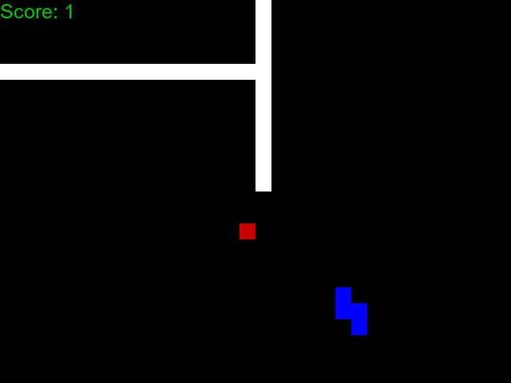
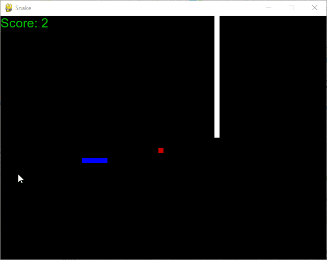

# Snake game NN

1. Pierwszy model

Nasz pierwszy model pochodził z pierwszego lepszego [repo](https://github.com/python-engineer/snake-ai-pytorch) typu "neural network learns snake". Model napisany przy użyciu pytorcha, wykorzystywał bardzo prosty Reinforcement learning - Q-learning. Model dosyć szybko uczył się podążać za jabłkiem, jednak jego problemem było nie zabijanie się o samego siebie, jednak nie zabijał się o krawędzie planszy. Postanowiliśmy zmodyfikować grę, wstawiając dwie ściany - pionową i poziomą, aby sprawdzić czy tak jak granic, będzie w stanie nauczyć się jej unikać. Początkowo po kilkudziesięciu iteracjach zaczynał kręcić się w kółko nie mogąc pozbyć się traumy rozbijania się o ściany. 
	


Zmniejszyliśmy zatem ilość ścian do 1. Rozwiązało to problem kręcenia się w kółko Niestety pomimo podawania do modelu informacji czy jest krok od śmierci, nawet po 90000 iteracji dalej ignorował ściane, biorąc za większy priorytet prostoliniową scieżkę do jabłka.



 Problem wynikał między innymi z danych podawanych do modelu na temat jedzenia. Model otrzymywał jedynie informację o położeniu jabłka względem węża, bez odległości, czy konkretnej pozycji np. (lewo, góra). Jego wizja także byla bardzo ograniczona sprowadzając się do wykrywania śmierci w obrębie jednej kratki. Ze względu na budowę samej gry nie byliśmy w stanie podawać do modelu wiecej informacji. Pierwszą zmianą było zmiana planszy na dwuwymiarową tablice.
 
 [Kod pierwszego modelu](https://github.com/Ziobrowskyy/AI-project/blob/master/Snake/model.py)

2. Drugi model

Drugi model wykorzystywał CNN. Uznaliśmy, że skoro pracujemy na dwuwymiarowej tablicy CNN będzie dobrym wyborem. Wykorzystaliśmy do tego biblioteke Keras.
Jednak nie bylimy w stanie doprowadzic go do dzialania, dlatego tez postanowilismy wrocic do reinforcement learnignu z wykorzystaniem algorytmu ewolucyjnego.

3. Trzeci model

Trzeci model wykorzystuje reinforcement learning polaczony z algorytmem ewolucyjnym (Keras oraz PyGAD) w celu optymalizacji nauki modelu. Model otrzymuje calosc planszy, gdzie w kazdy z typow komorki ma inna wartosc (np. puste - 0, sciana - 1 itd).  Kolejny model ktory mial tendencje do krecenia sie w kolko w celu unikniecia smierci od scian, nie nauczyl sie podazac za jedzeniem, nie rozpoznawal go. Model po ok 10000 iteracji nie wykazal zadnych zmian.

[Kod do modelu](https://github.com/Ziobrowskyy/AI-project/blob/develop/NewSnake/model.py)

4. Czwarty model

Czwarty i aktualny model posiadal kilka wersji z malymi tweakami.
Opiera sie na widzeniu weza w 8 kierunkach, zamiast otrzymywania kazdej planszy. W kazdym z nich otrzymuje informacji o odleglosci od jedzenia, sciany oraz samego siebie. 
Architektura modelu: 

```python
model = keras.Sequential([
	keras.layers.Input(shape=(1,)),
	keras.layers.Dense(64, activation="relu"),
	keras.layers.Dense(16, activation="relu"),
	keras.layers.Dense(3, activation="softmax"),
])
```
Ostatnia warstwa wykorzystuje funkcje softmax aby wybrac jeden z trzech kierunkow (prosto, lewo, prawo)
-- Parametry algorytmu ewolucyjnego:
```python
num_generations = 1000 # Number of generations

# Number of solutions to be selected as parents in the mating pool
num_parents_mating = 5

# Initial population of network weights
initial_population = keras_ga.population_weights
parent_selection_type = "sss" # Type of parent selection
crossover_type = "single_point" # Type of the crossover operator
mutation_type = "random" # Type of the mutation operator

# Percentage of genes to mutate. This parameter has no action if the parameter mutation_num_genes exists
mutation_percent_genes = 10

# Number of parents to keep in the next population. -1 means keep all parents and 0 means keep nothing
keep_parents = -1
```
- 4.1 Model po 3200 generacjach niczego sie nie nauczyl, postanowil szybko konczyc swoj  zywot wlatujac w najblizsza sciane. Ignorowal informacje o jedzeniu, nie unikal scian. 

[Kod do modelu](https://github.com/Ziobrowskyy/AI-project/blob/develop/NewSnake/model.py) 

Nastapila lekka zmiana architektury, dodalismy kolejna warstwe dense w celu sprawdzenia  wplywu na zachowanie modelu, zmienilismy takze jedna z aktywacji z relu na linear.
```python
model = keras.Sequential([
	keras.layers.Dense(24, activation="linear", input_shape=(24,)),
	keras.layers.Dense(32, activation="linear"),
	keras.layers.Dense(16, activation="relu"),
	keras.layers.Dense(4, activation="softmax"),
])
```
Kierunki uzyte w poprzeniej wersji slabo sie sprawdzaly, mialy duza tendencje do ciaglego krecenia sie w kolko. Dlatego tez softmax posiada teraz 4 kierunki (LURD). Jesli model zdecyduje wybrac przeciwny kierunek do terazniejszego - umiera. 

- 4.2 Wersja wprowadzila gratyfikowanie weza za przezycie kazdej klatki ulamkami punktow aby sprobowac zwiekszyc jego zywotnosc. Waz po setkach generacji faktycznie wydluzyl swoj zywot poprzez krecenie sie w kolko az do osiagniecia limitu iteracji.

[Kod do modelu](https://github.com/Ziobrowskyy/AI-project/blob/develop/NewSnake2/model.py)

- 4.3 Aby skontrowac wezowa karuzele, zwiekszylismy poczatkowa dlugosc weza do 5 kratek, aby nie byl w stanie na starcie zaczac sie krecic. Po prostu wchodzil sam w siebie i umieral. Tracac mozliwosc krecenia sie na starcie zaczal chodzic zygzakiem, aby przetrwac jak najdluzej przed uzderzeniem w sciane, a w koncu po okresie bardzo chaotycznego zachowania raz na jakis czas unikal zderzenia ze sciana. Zaobserwowalismy takze lekkie zainteresowanie jedzeniem, czasami podazal w kierunku jedzenia, aczkolwiek w przeciagu ok. 500 generacji nie przynioslo to lepszych rezultatow.

[Kod do modelu](https://github.com/Ziobrowskyy/AI-project/blob/develop/NewSnake3/model.py)

- 4.4 Wersja (narazie) ostateczna - Nie dostaje informacji o odleglosci od jedzenia i jego ciala tylko czy w danym kierunku sie ono znajduje, dalej otrzymuje informacje o odleglosci od sciany. Zmiana generacji scian na dwie pionowe, aby unkinac sytuacji jedzenia zamknietego za scianami bez mozliwosci dostania sie do niego.

[Kod do modelu](https://github.com/Ziobrowskyy/AI-project/blob/develop/NewSnake4/model.py)

Pomysly rozwoju:

-- zwiekszenie ilosci jedzenia, aby zwiekszyc szanse weza na losowe trafienie na nie, aby ulatwic mu zrozumienie, ze jedzenie dobre.

-- Nauczenie weza gry bez scian, a nastepnie gdy nauczy sie podazac za jedzeniem, wykorzystanie tego modelu na planszy z dodatkowymi scianami

-- Zamiast zabijac weza gdy wybierze przeciwny kierunek - ignorowanie akcji lub samo odebranie punktow. Moze to przyspieszyc nauke poprzez zmniejszenie ilosci poczatkowcyh zgonow.
